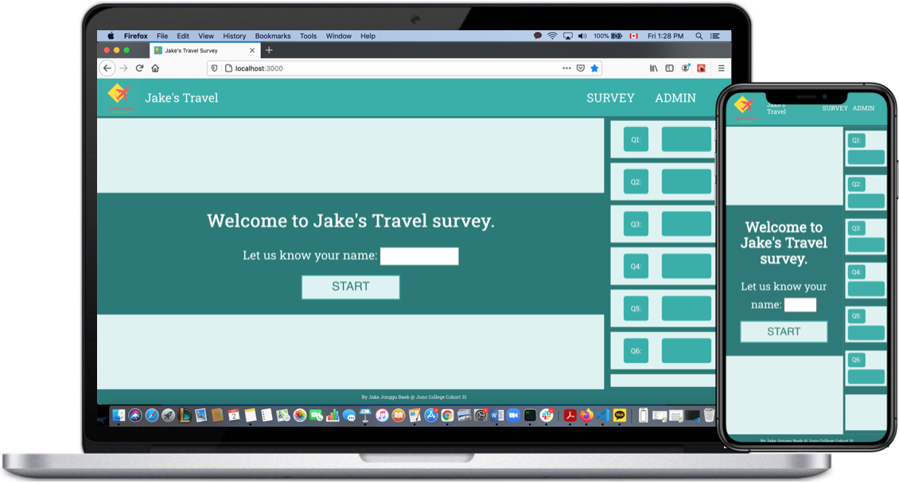
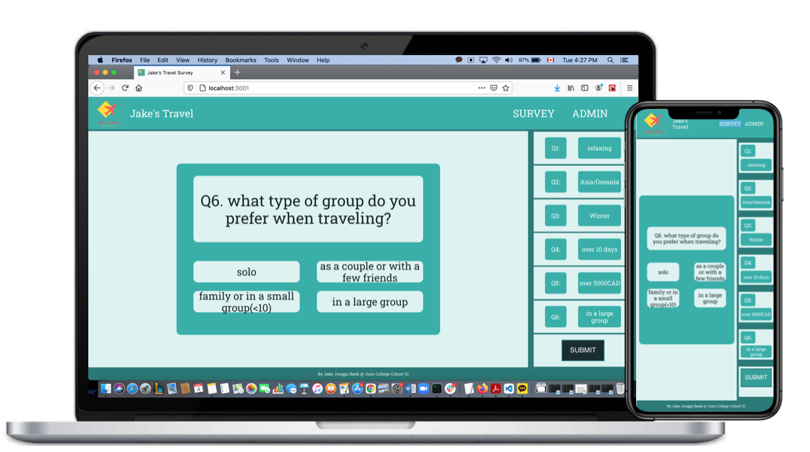
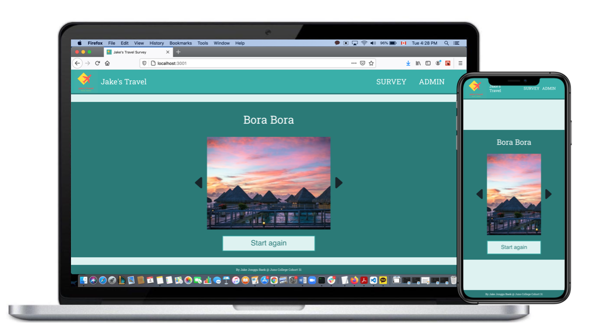

<h1 align="center">Jake's Travel</h1>

<strong>Take a survey to let your travel agent find the best options for your vacations.</strong>

 

<h2>About</h2>
Travel survey web application built with React, SASS, and RESTful API. 
LIVE DEMO :https://travel-survey.netlify.app/
 

<h2>Purpose</h2>
This application will provide a survey to collect data about user's travel style & preference. The answers will be stored in data base so travel agent can target the right customers.
 

<h2>Key feature</h2>
<ul>
<li>Landing Page</li>
<li>Survey Page</li>
<li>Survey Results Page</li>
<li>Admin Page</li>
</ul>
 

<h2>Landing Page</h2>

1. Input box where users can type their names. 

2. Start button will start the survey

 

<h2>Survey Page</h2>

User will be given 6 survey questions

<ul>
<li> Purpose of travel</li>
<li> Preferred destination</li>
<li> Preferred season</li>
<li> Vacation duration</li>
<li> Budget plan</li>
<li> Preferred travel company size</li>
</ul>
 

<h2>Survey Results Page</h2>

Result page will show users recommendation on travel destination based on their answers

 

<h2>Admin Page</h2>

Travel agent can search customers' names and check their travel preferences.

 

<h2>Features to be added in the future</h2>

Better website lay out and design

More functions in Admin page - i.e modify question / modify answers etc

<h2>Copyright</h2>
This project is licensed under the terms of the MIT license and protected by Udacity Honor Code and Community Code of Conduct. See <a href="LICENSE.md">license</a> and <a href="LICENSE.DISCLAIMER.md">disclaimer</a>